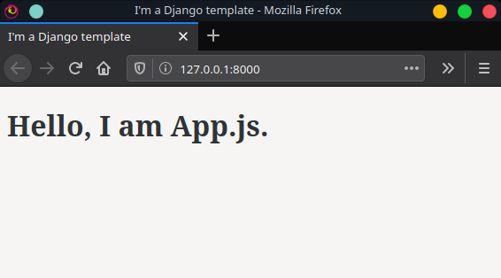

# React-in-Django

This is an app that doesn't do anything! Here's what it looks like:



This project scaffold demonstrates how to set up a Django project that serves a React front end.

## What's Included

- A basic `app/` set up with Django settings and `urls.py`.
- A `backend/` with one [Django model](https://docs.djangoproject.com/en/3.0/topics/db/models/), `Idea`, and [Django Rest Framework's](https://www.django-rest-framework.org/) `api/` basics.
  - Browse the API at `http://localhost:8000/api/`
- A `frontend/` with `src/`, which is loaded with Django `templates/`, to help you get started with React.

## Usage

Clone repo:

```bash
git clone https://github.com/victoriadrake/react-in-django.git
```

Install dependencies:

```bash
pipenv install
```

Run the Django server:

```bash
pipenv run python manage.py runserver
```

Build out this starting point into an app that actually does stuff!

## Bonus: Django Security Check

The [Django Security Check GitHub Action](https://github.com/victoriadrake/django-security-check) can help you automatically check for security misconfigurations in your production Django application. See the [`security-check.yml` workflow file](https://github.com/victoriadrake/react-in-django/blob/v1.0.1/.github/workflows/security-check.yml) for an example.
